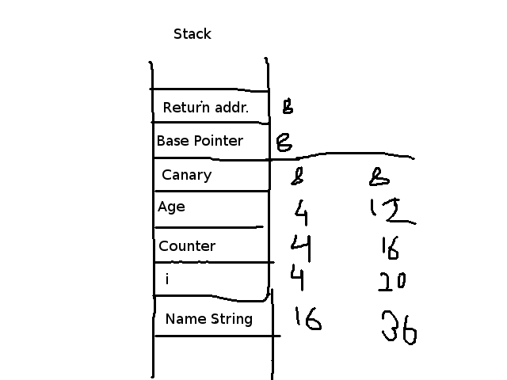

## Solution

   This challenge is like a buffer overflow challenge, but there are stack protection measures (canary). 
   
   In this, we have to overflow the buffer with the input 'name' string, till the 'counter' variable, such that the most significant two bytes store value greater than b'10 . 
   
   Then, we take the 'age' input as integer, and then based on 'counter' value, we display those many 4-bytes int. If the 'counter' variable has been proper;y overwritten, the values of canary can be displayed. 
   
   Then, we ask for the age again, but now, as a string, and the input should be such that it overwrites the return address, but the value of canary should be overwritten with the value received from the previous output, such that the canary is intact. 
   
   Then, we can jump to some 'flag' function, that delivers the flag to us.
   
   